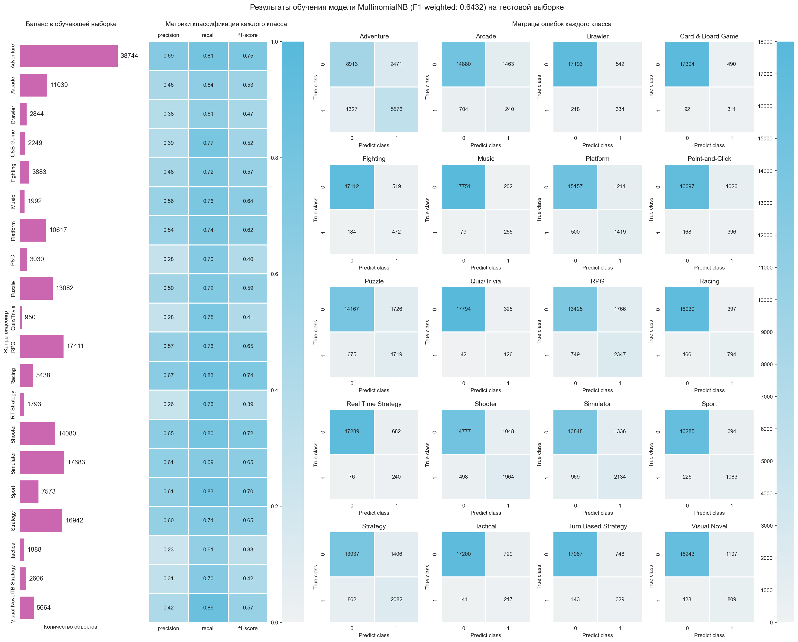
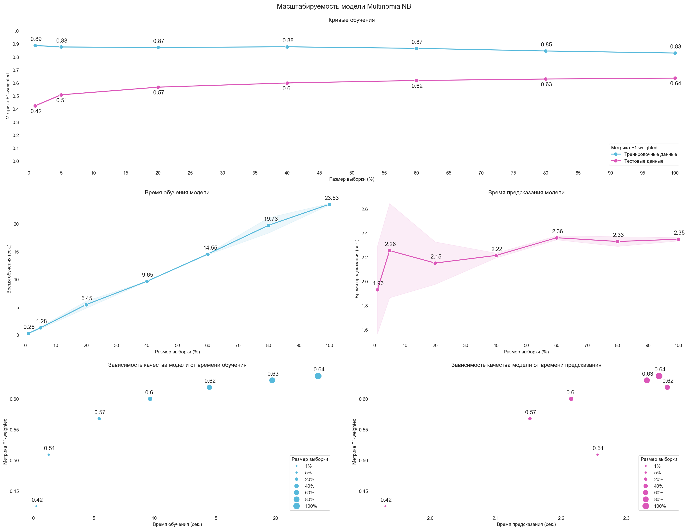

## Цель и задачи проекта

**Цель проекта**: провести анализ данных, размещенных на сайте 
[backloggd.com](https://www.backloggd.com/), 
на их основе обучить модель, предсказывающую игровые жанры, 
к которым принадлежит видеоигра с заданным описанием.

**Задачи проекта**:
1. Собрать и систематизировать данные, 
размещенные на сайте [backloggd.com](https://www.backloggd.com/).
2. Предварительно обработать и провести разведочный анализ данных.
3. Провести статистический анализ данных.
4. Обучить модель, выработать систему по оценки её эффективности.
5. Создать веб-сервис, способный обрабатывать запросы пользователя.

## Этапы проекта 

<table>
    <thead>
        <tr>
            <th>№</th>
            <th>Название этапа</th>
            <th>Описание этапа</th>
            <th>Инструменты</th>
        </tr>
    </thead>
    <tbody>
        <tr>
            <td>1</td>
            <td>Сбор и систематизация данных</td>
            <td>
                Написание программы, осуществляющей сбор и систематизацию данных 
                с сайта <a href="https://www.backloggd.com">backloggd.com</a>.
                Сбор и систематизация данных.
            </td>
            <td> 
                <ul>
                    <li>AIOHTTP</li>
                    <li>BeautifulSoup4</li>
                </ul> 
            </td> 
        </tr>
         <tr>
            <td>2</td>
            <td>Разведочный анализ данных</td>
            <td>
                Анализ основных свойств данных, выявление распределений, 
                общих зависимостей и аномалий 
                с помощью инструментов визуализации.
            </td>
            <td> 
                <ul>
                    <li>Jupyter</li>
                    <li>Matplotlib</li>
                    <li>NumPy</li>
                    <li>Pandas</li>
                    <li>Seaborn</li>
                </ul> 
            </td>
        </tr>
        <tr>
            <td>3</td>
            <td>Статистический анализ данных</td>
            <td>
                Подтверждение или опровержение закономерностей, 
                выявленных на этапе разведочного анализа данных.
            </td>
            <td> 
                <ul>
                    <li>Jupyter</li>
                    <li>Matplotlib</li>
                    <li>NumPy</li>
                    <li>Pandas</li>
                    <li>SciPy</li>
                    <li>Seaborn</li>
                </ul> 
            </td>
        </tr>
        <tr>
        <td>4</td>
            <td>Обучение модели</td>
            <td>
                На основе предварительно обработанных данных, обучение модели, 
                предсказывающей игровые жанры, 
                к которым принадлежит видеоигра с заданным описанием. 
                Выработка системы по оценке эффективности модели.
            </td>
            <td> 
                <ul>
                    <li>Jupyter</li>
                    <li>NLTK</li>
                    <li>NumPy</li>
                    <li>Pandas</li>
                    <li>Seaborn</li>
                    <li>Scikit-learn</li>
                </ul> 
            </td>
        </tr>
        <tr>
            <td>5</td>
            <td>Создание веб-сервиса</td>
            <td>
                Интеграция модели в веб-сервис.
            </td>
            <td> 
                <ul>
                    <li>FastAPI</li>
                    <li>Pandas</li>
                    <li>Uvicorn</li>
                </ul> 
            </td>
        </tr>
    </tbody>
</table>

## Блокноты

1. [exploring.ipynb](notebooks/exploring.ipynb) - предварительная обработка 
и проведение разведочного анализа данных.
2. [statistics.ipynb](notebooks/statistics.ipynb) - статистический анализ данных.
3. [training.ipynb](notebooks/training.ipynb) - обучение модели, 
выработка системы по оценки её эффективности.

## Набор данных

Набор данных размещен на сайте 
[kaggle.com](https://www.kaggle.com/datasets/gsimonx37/backloggd/data), 
последнюю версию набора данных вы можете найти там.

## Документация

1. [Начало работы](docs/starting.md).
2. [Структура проекта](docs/structure.md).
3. [Описание данных](docs/data.md).
4. [Получение данных](docs/parsing.md).
5. [Предварительная обработка данных](docs/preprocessing.md).
6. [Тренировка и оценка моделей](docs/training.md).
7. [Запуск приложения](docs/application.md).

## Результаты
Было отобрано **20** наиболее распространенных жанров видеоигр.
В данных **присутствует дисбаланс классов**:
- **мажоритарным** классом является класс **Adventure**; 
- **миноритарным** классом является класс **Quiz/Trivia**.

Для каждого класса существует свой **уникальный** список 
наиболее часто встречающихся слов в описаниях видеоигр.

Наилучшей предсказательной способностью обладает модель **SGDClassifier**. 
На тестовых данных удалось достичь метрики **F1-weighted** более **0.59**

Кривые обучения показывают, что **присутствует** признак переобучения модели. 
**Добавление новых данных не улучшит** предсказательную способность модели. 
При добавлении новых данных **время обучения** возрастает **линейно**,
**время предсказания** - **не меняется**.

Модель имеет **неплохую точность** прогнозирования вероятности принадлежности 
объекта к тому или иному классу. 
Прогнозируемая вероятность распределена **неравномерно**, тем не менее, 
**отсутствуют** явно преобладающие диапазоны. 
Для более точного прогнозирования вероятности **необходима калибровка** модели.

## Благодарности

Спасибо [Ирине Романовской](https://www.linkedin.com/in/irina-romanovsky-034338143/) 
([GitHub](https://github.com/needsomecats)) за помощь и поддержку 
в работе над данным проектом.

## Лицензия

Распространяется по лицензии GNU General Public License v3.0. 
См. [LICENSE](LICENSE.txt) для получения дополнительной информации.
