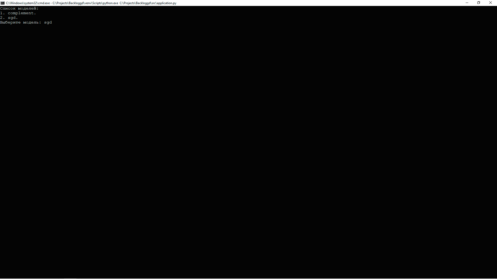
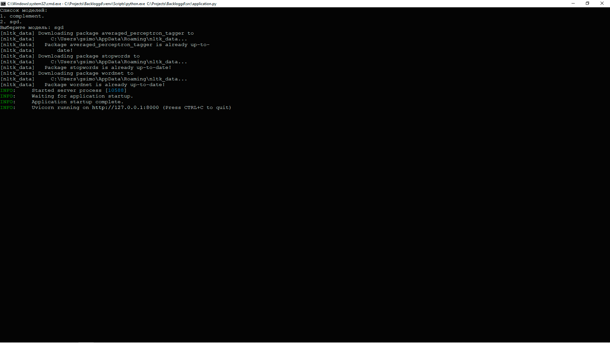

# Запуск приложения

Вы можете запустить приложение непосредственно из текущего окружения 
или в контейнере Docker.

## Запуск приложения
Точка входа запуска приложения находится в файле 
[application.py](../src/application.py):

```python
import os

import uvicorn

from app.application import model
from config.paths import PATH_TRAINED_MODELS
from utils.explorer import explorer


def main() -> None:
    """
    Тока входа запуска приложения;

    :return: None.
    """

    names = explorer(PATH_TRAINED_MODELS)
    os.system('cls')
    print('Список моделей:', names, sep='\n', flush=True)

    if directory := input('Выберите модель: '):
        file = PATH_TRAINED_MODELS + rf'\{directory}\{directory}.joblib'
        labels = PATH_TRAINED_MODELS + rf'\{directory}\labels.json'

        model.load(file, labels)

        uvicorn.run(
            app="app.application:app",
            host="127.0.0.1",
            port=8000,
            log_level="info"
        )


if __name__ == "__main__":
    main()
```

Чтобы приложение начало работу, необходимо запустить данный файл. 
Программа отобразит содержимое директории [models](../models), 
где хранятся модели, обученные на этапе тренировки моделей 
(см. [Тренировка моделей](training.md)).



После выбора модели, приложение начнет свою работу.



Запрос к приложению осуществляется посредством **post-запроса**, 
в теле которого должно быть указано:
1. description - описание видеоигры на английском языке;
2. threshold - порог принятия решения о принадлежности видеоигры к жанру.

Пример программы, осуществляющей запрос к приложению и получающей ответ от него:

```python
import requests

data = {
    'description': '',
    'threshold': 0.5
}
r = requests.post('http://127.0.0.1:8000/', json=data)

print(r.content.decode('utf-8'))
```

Тело ответа на запрос содержит:
1. description - описание видеоигры на английском языке.
2. threshold - порог принятия решения о принадлежности видеоигры к жанру.
3. genres - предсказанные жанры с вероятностями к которым принадлежит видеоигра, 
с переданным в теле запроса описанием.

## Запуск приложения в контейнере Docker

Чтобы запустить приложение в контейнере Docker необходимо создать образ из файла 
[Dockerfile](../Dockerfile):

```
FROM python:3.10

COPY ./requirements.txt ./requirements.txt
RUN pip install --no-cache-dir --upgrade -r ./requirements.txt

COPY ./models/complement ./models/complement
COPY ./src/app ./app
COPY ./src/run.py .
COPY ./src/utils/data ./utils/data

CMD ["python", "run.py", "complement"]
```

Чтобы создать образ, необходимо выполнить следующую команду:

```commandline
docker build -t application .
```

После создания образа необходимо запустить приложение в контейнере:

```commandline
docker run -d --name heart-disease-serving -p 8000:8000 application
```

[К описанию проекта](../README.md)