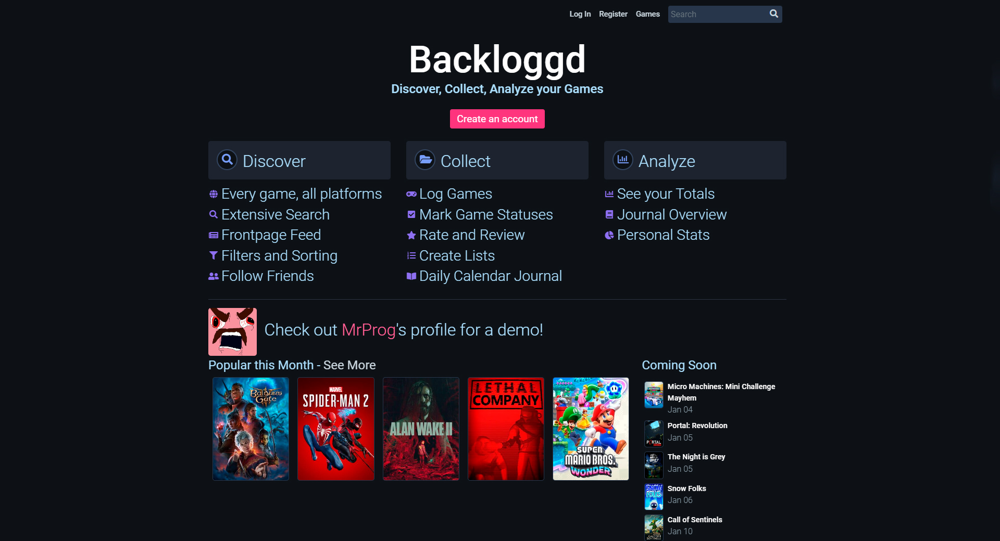
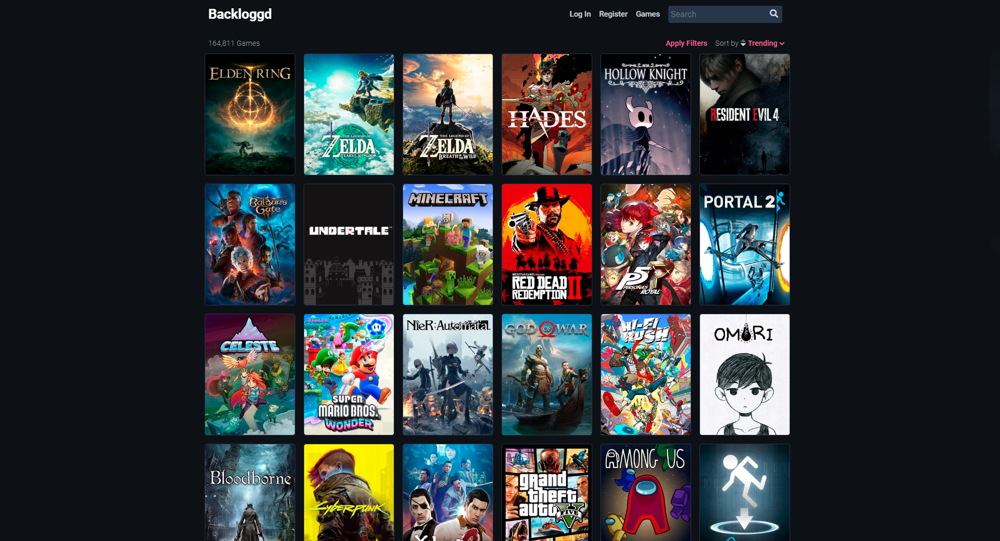
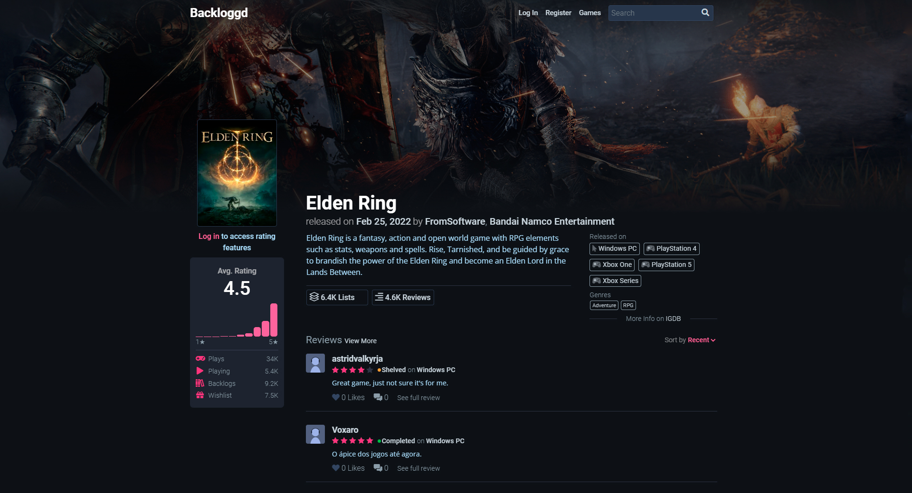

# Описание данных

Данные собраны и систематизированы с помощью программы с сайта 
[backloggd.com](https://www.backloggd.com/) (см. [сбор данных](parsing.md)).

## О сайте backloggd.com:

"**Backloggd** — это место для хранения вашей личной коллекции видеоигр. 
Каждая игра со всех платформ доступна для вас, 
чтобы вы могли войти в свой журнал. Следуйте за друзьями, 
чтобы поделиться своими отзывами и сравнить рейтинги. Затем используйте фильтры, 
чтобы отсортировать свою коллекцию и посмотреть, что для вас важно. 
Ведите список того, во что вы сейчас играете и во что хотите играть, 
и наблюдайте, как цифры меняются по мере того, 
как вы продолжаете записывать свои прохождения. Есть Goodreads для книг, 
Letterboxd для фильмов и теперь Backloggd для игр." - с сайта 
**[backloggd.com](https://www.backloggd.com/)**.

"Все метаданные, связанные с игрой, поступают из базы данных **[IGDB](https://www.igdb.com/)**, 
управляемой сообществом. Сюда входят все данные об играх, 
компаниях и платформах, которые вы видите на сайте." - с сайта 
**[backloggd.com](https://www.backloggd.com/)**.

## Описание полей

Данные содержат следующие поля:
1. **name** - название;
2. **date** - дата выхода;
3. **genres** - игровые жанры;
4. **platforms** - игровые платформы;
5. **developers** - группа разработчиков;
6. **rating** - средний рейтинг;
7. **votes** - количество оценок пользователей;
8. **category** - тип релиза;
9. **reviews** - количество отзывов пользователей;
10. **plays** - общее количество игроков;
11. **playing** - количество игроков в настоящий момент;
12. **backlogs** - количество добавлений в backlog;
13. **wishlists** - количество добавлений в wishlist;
14. **description** - описание видеоигры.

[К описанию проекта](../README.md)