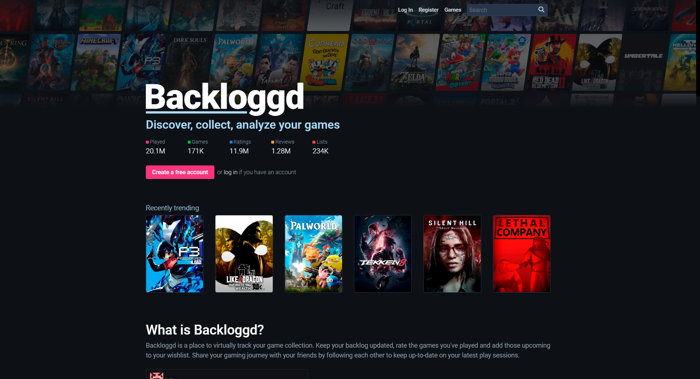

# Описание данных

Данные собраны и систематизированы с помощью программы с сайта 
[backloggd.com](https://www.backloggd.com/) (см. [сбор данных](parsing.md)).

## О сайте backloggd.com:

"**Backloggd** — это место для хранения вашей личной коллекции видеоигр. 
Каждая игра со всех платформ доступна для вас, 
чтобы вы могли войти в свой журнал. Следуйте за друзьями, 
чтобы поделиться своими отзывами и сравнить рейтинги. Затем используйте фильтры, 
чтобы отсортировать свою коллекцию и посмотреть, что для вас важно. 
Ведите список того, во что вы сейчас играете и во что хотите играть, 
и наблюдайте, как цифры меняются по мере того, 
как вы продолжаете записывать свои прохождения. Есть Goodreads для книг, 
Letterboxd для фильмов и теперь Backloggd для игр." - с сайта 
**[backloggd.com](https://www.backloggd.com/)**.

"Все метаданные, связанные с игрой, поступают из базы данных **[IGDB](https://www.igdb.com/)**, 
управляемой сообществом. Сюда входят все данные об играх, 
компаниях и платформах, которые вы видите на сайте." - с сайта 
**[backloggd.com](https://www.backloggd.com/)**.

## Описание полей

Данные содержат следующие поля:
1. **games** - основные данные:
   - **id** - идентификатор видеоигры (первичный ключ);
   - **name** - название видеоигры; 
   - **date** - дата релиза видеоигры;
   - **rating** - средний рейтинг видеоигры;
   - **reviews** - количество отзывов;
   - **plays** - общее количество игроков;
   - **playing** - количество игроков в настоящий момент;
   - **backlogs** - количество добавлений видеоигры в backlog;
   - **wishlists** - количество добавлений видеоигры в "избранное";
   - **description**  - описание видеоигры.
2. **developers** - разработчики (издатели):
    - **id** - идентификатор видеоигры (внешний ключ);
    - **developer** - разработчик (издатель) видеоигры.
3. **platforms** - игровые платформы:
    - **id** - идентификатор видеоигры (внешний ключ);
    - **platform** - игровая платформа.
4. **genres** - игровые жанры:
    - **id** - идентификатор видеоигры (внешний ключ);
    - **genre** - жанр видеоигры.
5. **scores** - оценки пользователей:
    - **id** - идентификатор видеоигры (внешний ключ);
    - **score** - оценка (от 0.5 до 5 с шагом 0.5);
    - **amount** - количество пользователей.
6. **posters** - постеры видеоигр.

## Обновление данных

На сайте [backloggd.com](https://www.backloggd.com/roadmap) размещена подробная 
дорожная карта с изменениями, которые возможно со временем будут реализованы 
на сайте, среди них:
- дополнительная информация об игре: статус DLC, все компании, 
альтернативные названия и другая обширная информация об игре;
- категоризация игр: какие игры являются DLC, демо-версиями, отмененными, 
бета-версиями и т. д.;
- персонализированные обложки для игр: IGDB теперь поддерживает локализованные 
обложки;
- даты выпуска: игры с одной датой — это слишком просто, 
в этом случае будет показано несколько дат выпуска для разных этапов/регионов.

Если реализованы на сайте изменения, будут представлять интерес, 
данный набор будет обновлен в соответствии с новыми данными.

Помимо этого, независимо от изменений на сайте, данные будут 
обновляться ежегодно, с целью поддержания своей актуальности.

[К описанию проекта](../README.md)