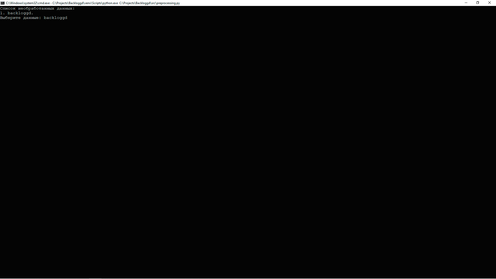

# Предварительная обработка данных

Точка входа для предварительной обработки данных находится в файле 
[preprocessing.py](../src/preprocessing.py):

```python
import os

from config.paths import PATH_RAW_DATA
from utils.data.preprocessing import preprocessing
from utils.explorer import explorer


def main():
  """
  Тока входа предварительной обработки данных;

  :return: None.
  """

  names = explorer(PATH_RAW_DATA, exclude=('checkpoints',))
  os.system('cls')
  print('Список необработанных данных:', names, sep='\n', flush=True)

  if data := input('Выберите директорию: '):
    preprocessing(data)


if __name__ == '__main__':
  main()
```

На данном этапе:
- удаляются явные дубликаты;
- добавляется логическое поле **indie**;
- удаляются значения **indie** из файла **genres**;
- рассчитывает рейтинг на основе данных **scores**;
- добавляется поле **votes**;
- удаляются пустые записи;
- изменяются типы данных;
- удаляются неявные дубликаты;
- удаляются записи с отрицательными значениями в полях: 
    - **reviews**;
    - **plays**;
    - **playing**;
    - **backlogs**;
    - **wishlists**.

Чтобы начать процесс предварительной обработки данных, 
необходимо запустить данный файл. Программа отобразит содержимое каталога 
[raw](../data/raw), где хранятся данные, 
сформированные на этапе сбора данных (см. [сбор данных](parsing.md)).



После предварительной обработки данных, 
в каталоге [processed](../data/processed) появятся данные в формате `.csv`. 
Название каталога будет совпадать с названием каталога в каталоге 
[raw](../data/raw).

>Обратите внимание, файлы из директории [raw](../data/raw) не удаляются.

>Изображения из каталога [raw](../data/raw) не копируются 
> в каталог [processed](../data/processed) с целью экономии пространства.

[К описанию проекта](../README.md)
