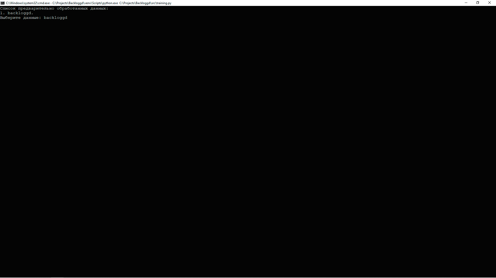

# Тренировка и оценка моделей

Точка входа тренировки моделей находится в файле 
[training.py](../src/training.py):

```python
import os

import pandas as pd

from config.paths import PATH_MODELS
from config.paths import PATH_PREPROCESSED_DATA
from ml.training import train
from utils.explorer import explorer


def main():
    """
    Тока входа тренировки моделей на предварительно обработанных данных;

    :return: None.
    """

    names = explorer(PATH_PREPROCESSED_DATA, ext='*.csv')
    os.system('cls')
    print('Список предварительно обработанных данных:', names,
          sep='\n',
          flush=True)

    if name := input('Выберите данные: '):
        data = pd.read_csv(f'{PATH_PREPROCESSED_DATA}/{name}')

        models = {}

        print(flush=True)
        names = explorer(path=PATH_MODELS,
                         ext='*.py',
                         exclude=('__init__.py', 'model.py'))
        print('Список файлов c моделями:', names, sep='\n', flush=True)

        if files := input('Выберите один или несколько файлов: '):
            for file in files.split():
                name = file.split('.')[0]

                modul = __import__(
                    name=f'ml.models.{name}',
                    globals=globals(),
                    locals=locals(),
                    fromlist=['student'],
                    level=0
                )

                models[name] = modul.model

        train(
            models=models,
            data=data,
            n_trials=300,
            n_jobs=4
        )


if __name__ == '__main__':
    main()
```

## Тренировка моделей

Чтобы начать процесс тренировки моделей, необходимо запустить данный файл. 
Программа отобразит содержимое каталога [processed](../data/processed), 
где хранятся файлы, сформированные на этапе предварительной обработки данных 
(см. [Предварительная обработка данных](preprocessing.md)). Необходимо выбрать файл 
с данными, на которых модель (модели) будут обучаться.



После выбора данных, на которых будет проводиться тренировка, 
необходимо выбрать одну или несколько файлов, описывающих задачу и процесс 
оптимизации для конкретной модели.


Все файлы должны располагаться в каталоге [models](../src/ml/models), 
с расширением `*.py` и содержать экземпляр класса `Model` в котором содержатся:
1. model: pipeline модели;
2. name: название модели, которое будет отображаться на графиках;
3. params: пространство гиперпараметров, подбор которых будет осуществляться 
с помощью пакета [Optuna](https://optuna.org).
4. metric: функция оценки модели на тестовой выборке.
5. scoring: функция оценки модели во время кросс валидации.
6. cv: метод кросс валидации.

```python
from nltk.corpus import stopwords
from sklearn.feature_extraction.text import TfidfVectorizer
from sklearn.metrics import f1_score
from sklearn.metrics import make_scorer
from sklearn.multioutput import MultiOutputClassifier
from sklearn.naive_bayes import ComplementNB
from sklearn.pipeline import Pipeline

from .model import Model


vectorizer = TfidfVectorizer(
    analyzer='word',
    stop_words=stopwords.words('english'),
    ngram_range=(1, 3)
)

standardizer = Pipeline(
    steps=[
        ('vectorizer', vectorizer)
    ]
)

estimator = ComplementNB(
    force_alpha=True
)
estimator = MultiOutputClassifier(
    estimator=estimator,
    n_jobs=4
)

model = Pipeline(
    steps=[
        ('standardizer', standardizer),
        ('estimator', estimator)
    ]
)

params = {
    'standardizer__vectorizer__norm': ['categorical', [None, 'l1', 'l2']],
    'standardizer__vectorizer__sublinear_tf': ['categorical', [True, False]],
    'standardizer__vectorizer__max_features': ['int', {'low': 200_000,
                                                       'high': 1_500_000,
                                                       'step': 100_000}],
    'standardizer__vectorizer__min_df': ['int', {'low': 2,
                                                 'high': 20,
                                                 'step': 2}],
    'standardizer__vectorizer__max_df': ['float', {'low': 0.7,
                                                   'high': 1.0,
                                                   'step': 0.05}],
    'estimator__estimator__norm': ['categorical', [True, False]],
    'estimator__estimator__alpha': ['float', {'low': 0.1,
                                              'high': 1.0,
                                              'step': 0.05}]
}

scoring = make_scorer(
    score_func=f1_score,
    average='weighted',
    zero_division=0.0
)

model = Model(
    model=model,
    name='ComplementNB',
    params=params,
    metric=lambda x, y: f1_score(x, y, average='weighted'),
    scoring=scoring,
    cv=2
)
```

Количество испытаний можно задать с помощью аргумента `n_trials` функции `train`. 
Обычно хватает 200-300 испытаний для нахождения оптимальных гиперпараметров.

Изменить структуру и формат отображения прогресса обучения моделей, можно в 
файле [verbose.py](../src/utils/ml/verbose.py), путем модификации метода 
`__call__` класса `Verbose`:

```python
def __call__(self, study: Study, trial: FrozenTrial):
    index = trial.number + 1
    state = trial.state.name
    complete = (trial
                .datetime_complete
                .strftime('%d-%m-%Y %H:%M:%S'))
    seconds = (trial.datetime_complete - trial.datetime_start).seconds
    minutes = seconds // 60
    seconds = seconds % 60
    value = round(trial.values[0], 4)
    best = round(study.best_value, 4)

    print(f'{self.name}: [{complete}] - [{minutes:02}:{seconds:02}] - '
          f'{state}: {index}/{self.trials} - {value:.4f} ({best:.4f}).')
```

## Оценка моделей

После завершения обучения, в каталоге [models](../models) 
будет создан каталог с названием файла модели, указанного перед началом 
тренировки. В каталоге будут находиться файлы: 
- `labels.json` - метки классов, наблюдаемые во время тренировки модели.
- файл обученной модели с расширением `*.joblib`, имя которого будет совпадать 
с названием файла описывающего задачу и процесс оптимизации для конкретной 
модели, указанного перед началом тренировки.

В каталоге [training](../reports/training) будет создан каталог с одноименным 
названием. 
В каталоге будут находиться: 
1. Файл `params.json` - гиперпараметры модели, при которых предсказательная 
способность модели была наилучшей.
2. Файл `trials.csv` - результаты всех испытаний.
3. Каталог `images` - графические материалы.

В каталоге `images` будут содержаться следующие файлы:
- `words.png` - результаты частотного анализа;
- `balance.png` - баланс классов в тренировочной и тестовой выборах;
- `metrics.png` - предсказательная способность модели;
- `scalability.png` - масштабируемость модели;
- `calibration.png` - калиброванность модели;
- `dummy.png` - предсказательная способность простой эмпирической модели;
- `studies.png` - исследование пространства гиперпараметров.

Примеры графических материалов, сформированных по результатам тренировки модели:


[К описанию проекта](../README.md)