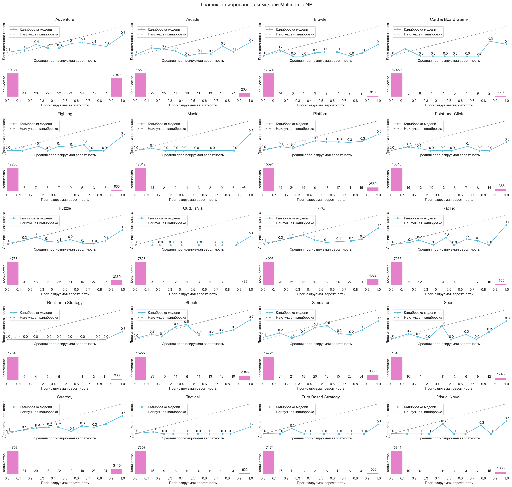

# Тренировка и оценка моделей

Точка входа тренировки моделей находится в файле 
[training.py](../src/training.py):

```python
import os

from config.paths import FILE_PREPROCESSED_PATH
from config.paths import MODELS_PATH
from ml.training import fit
from utils.explorer import explorer


def main():
    """
    Тока входа тренировки моделей на предварительно обработанных данных;

    :return: None.
    """

    names = explorer(FILE_PREPROCESSED_PATH, '*.csv')
    os.system('cls')
    print('Список предобработанных файлов:', names, sep='\n', flush=True)

    if data := input('Выберите файл: '):
        models = []

        print(flush=True)
        names = explorer(MODELS_PATH, '*.py')
        print('Список файлов c моделями:', names, sep='\n', flush=True)

        if files := input('Выберите один или несколько файлов: '):
            for file in files.split():
                name = file.split('.')[0]

                modul = __import__(
                        name=f'training.models.{name}',
                        globals=globals(),
                        locals=locals(),
                        fromlist=['title', 'model', 'params'],
                        level=0
                )

                models.append(
                        {
                            'name': name,
                            'title': modul.title,
                            'model': modul.model,
                            'params': modul.params,
                        }
                )

        fit(file=data, models=models)


if __name__ == '__main__':
    main()
```

## Тренировка моделей

Чтобы начать процесс тренировки моделей, необходимо запустить данный файл. 
Программа отобразит содержимое каталога [processed](../data/processed), 
где хранятся файлы, сформированные на этапе предварительной обработки данных 
(см. [Предварительная обработка данных](preprocessing.md)).


После выбора данных, на которых будет проводиться тренировка, 
необходимо выбрать одну или несколько моделей. 


Все модели должны располагаться в каталоге [models](../src/ml/models), 
с расширением `*.py` и иметь следующее содержимое:
1. title - заголовок, который будет использован при построении отчетов.
2. model - модель машинного обучения.
3. params - гиперпараметры модели.

```python
import numpy as np

from sklearn.compose import ColumnTransformer
from sklearn.feature_extraction.text import TfidfVectorizer
from sklearn.linear_model import SGDClassifier
from sklearn.multioutput import MultiOutputClassifier
from sklearn.pipeline import Pipeline
from sklearn.preprocessing import MaxAbsScaler


title = 'SGDClassifier'

vectorizer = TfidfVectorizer(
    analyzer='word',
    sublinear_tf=True
)

standardizer = ColumnTransformer(
    transformers=[
        ('vectorizer', vectorizer, 0),
        ('scaler', MaxAbsScaler(), slice(1, None))
    ]
)

estimator = SGDClassifier(
    loss='log_loss',
    penalty='elasticnet',
    random_state=42
)

estimator = MultiOutputClassifier(
    estimator=estimator,
    n_jobs=4
)

model = Pipeline(
    steps=[
        ('standardizer', standardizer),
        ('estimator', estimator)
    ]
)

params = {
    'standardizer__vectorizer__ngram_range': [(1, 1), (1, 2), (1, 3)],
    'standardizer__vectorizer__norm': [None, 'l1', 'l2'],
    'standardizer__vectorizer__max_features': np.arange(
        start=750_000,
        stop=1_000_001,
        step=250_000
    ).tolist(),
    'estimator__estimator__alpha': np.linspace(
        start=0.1,
        stop=0.5,
        num=5
    ).round(5).tolist(),
    'estimator__estimator__class_weight': [None, 'balanced'],
    'estimator__estimator__l1_ratio': np.linspace(
        start=0.0,
        stop=0.5,
        num=6
    ).round(5).tolist()
}
```

## Оценка моделей

После завершения обучения, в каталоге [models](../models) 
будет создан каталог с названием файла модели, 
указанного перед началом тренировки. В каталоге будут находиться файлы: 
- `labels.json` - метки классов, наблюдаемые в данных, 
во время тренировки модели.
- файл тренированной модели с расширением `*.joblib`, 
имя которого будет совпадать с названием файла модели, 
указанного перед началом тренировки.

В каталоге [training](../reports/training) будет создан каталог 
с названием файла модели, указанного перед началом тренировки. 
В папке будут находиться: 
1. Файл `best_params.json` - гиперпараметры модели, 
при которых предсказательная способность модели была наилучшей.
2. Файл `cv_results.csv` - результаты кросс-валидации.
3. Каталог `images` - графические материалы.

В каталоге `images` будут содержаться следующие файлы:
- `words.png` - результаты частотного анализа;
- `balance.png` - баланс классов в тренировочной и тестовой выборах;
- `metrics.png` - предсказательная способность модели;
- `scalability.png` - масштабируемость модели;
- `calibration.png` - калиброванность модели.

Примеры графических материалов, сформированных по результатам тренировки модели:





[К описанию проекта](../README.md)